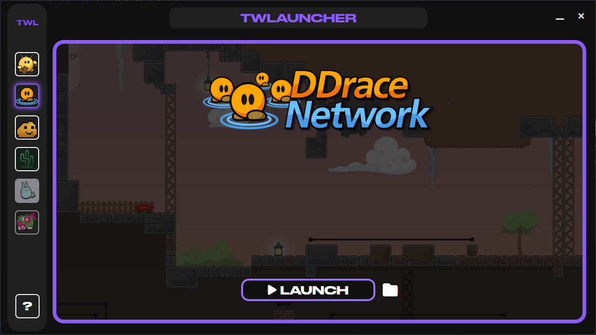

<div align="center">
  <div>
      
  </div>
  <h1>TWLauncher</h1>
    
  <a href="https://discord.gg/mwPZAQwrDB"></a>  
    
</div>

**TWLauncher** (Teeworlds Launcher, or TWL) is a Windows application designed to simplify the management and launching of various Teeworlds clients. With a cool, modern interface, it supports popular clients & automatic updates.

## Screenshots

- **Launcher Interface**  
    

## Features

- **Game Management**: Easily launch popular Teeworlds clients from a single interface.
- **Steam Integration**: Automatically detects and launches Steam-installed clients like Teeworlds and DDraceNetwork.
- **Client Installation**: Downloads and installs clients (e.g., TClient, Cactus) with the latest versions.
- **System Tray**: Minimize to the system tray with a quick-access menu for launching clients.
- **Modern UI**: Customizable themes with a clean, modern design.
- **Auto Updates**: Checks and updates non-Steam clients to their latest versions.
- **Discord RPC**: Displays your current client and theme on Discord.
- **Content Browser**: Browse and download skins, game skins, emoticons, particles, and entities from teedata.net.
- **Cross-Platform Potential**: Built with Electron, enabling future multi-platform support (currently Windows-focused).

## Dependencies

- `electron`: Framework for building cross-platform desktop applications.
- `electron-builder`: Tool for packaging and distributing Electron apps.
- `winreg`: Accesses the Windows registry to locate Steam installations.
- `axios`: Handles HTTP requests for downloading updates and content.
- `adm-zip`: Manages ZIP file extraction for client installations.
- `discord-rpc`: Integrates Discord Rich Presence for status updates.
- `dotenv`: Loads environment variables (e.g., Discord Client ID).
- `font-awesome`: Provides icons for the user interface.
- `fs-extra`: Enhanced file system operations for configuration management.

## Installation

1. Download the latest release from [GitHub Releases](https://github.com/noxygalaxy/twlauncher/releases).
2. Run the installer or extract the portable version.
3. Launch `TWLauncher-x64.exe` to start the application.

## Usage

1. Open TWLauncher.
2. Select a client from the sidebar (e.g., Teeworlds, DDraceNetwork, TClient, Cactus).
3. Click **INSTALL** to download a new client or **LAUNCH** to start an installed one.
4. Use the **Content Browser** (plus icon) to download skins, emoticons, and more.
5. Minimize to the system tray for quick access.

## Compiling from Source

1. Clone the repository:
   ```bash
   git clone https://github.com/noxygalaxy/twlauncher.git
   ```
2. Navigate to the project directory:
   ```bash
   cd twlauncher
   ```
3. Install dependencies:
   ```bash
   npm install
   ```
4. Rename `.env.example` to `.env` file and replace inside with your own discord client id:
   ```env
   DISCORD_CLIENT_ID=YOUR_DISCORD_CLIENT_ID
   ```
5. Build the application:
   ```bash
   npm run build
   ```
6. Find the compiled app in the `dist` folder.

**Note**: Discord RPC is optional.

## Supported Clients

- **Teeworlds** (`tw`): Steam-based, launches via `steam://rungameid/380840`.
- **DDraceNetwork** (`ddnet`): Steam-based, launches via `steam://rungameid/412220`.
- **Tater Client** (`tclient`): Downloaded from [sjrc6/TaterClient-ddnet](https://github.com/sjrc6/TaterClient-ddnet).
- **Cactus Client** (`cactus`): Downloaded from other source.

## Configuration

TWLauncher stores its configuration in `twlconfig.json` located at `C:\Users\<YourUser>\AppData\Roaming\TWLauncher`. You can modify:

- **installPath**: Directory where non-Steam clients are installed (default: `AppData\TWLauncher\clients`).
- **theme**: UI theme (e.g., `default`, customizable via settings).
- **streamerMode**: For now just hides installation path in settings. (default: `false`)

## Contributing

We welcome contributions! To contribute:

1. Fork the repository.
2. Create a feature branch (`git checkout -b feature/your-feature`).
3. Commit your changes (`git commit -m "Add your feature"`).
4. Push to the branch (`git push origin feature/your-feature`).
5. Open a pull request.

Please report bugs or suggest features at [GitHub Issues](https://github.com/noxygalaxy/twlauncher/issues).

## Credits

- **Creator**: [@noxygalaxy](https://noxy.netlify.app)
- **Contributors**: [@dropalways](https://github.com/dropalways).
- **Made with**: Love and Node.js <3
- **Special Thanks**: To the Teeworlds community for inspiration :)
- **More Special Thanks**: 
  - [@sollybunny](https://github.com/sollybunny) & [@sjrc6](https://github.com/sjrc6) for allowing me use their Tater Client in launcher.
  - [@handerfall](https://github.com/handerfall) for allowing me use their Cactus Client in launcher.

## License

TWLauncher is open-source and licensed under the [MIT License](LICENSE).

## Support

- **Discord**: [Join our server](https://discord.gg/mwPZAQwrDB)
- **Telegram**: [Follow us](https://t.me/twlauncher)
- **Website**: [twlauncher.netlify.app](https://twlauncher.netlify.app)
- **Issues**: [Report bugs](https://github.com/noxygalaxy/twlauncher/issues)
